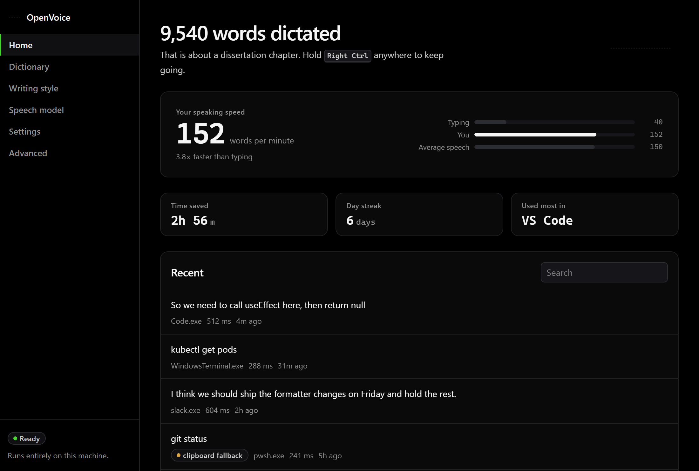
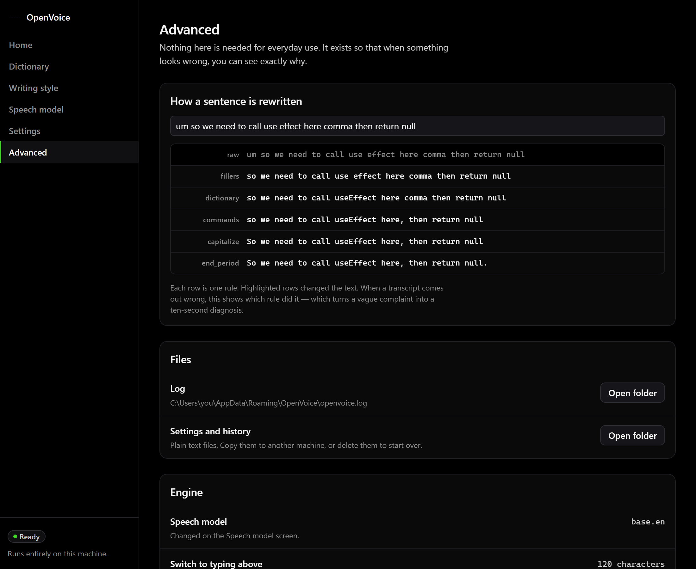
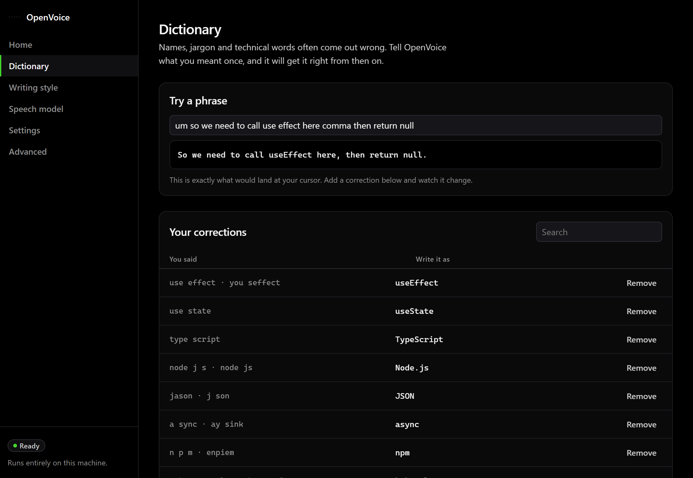
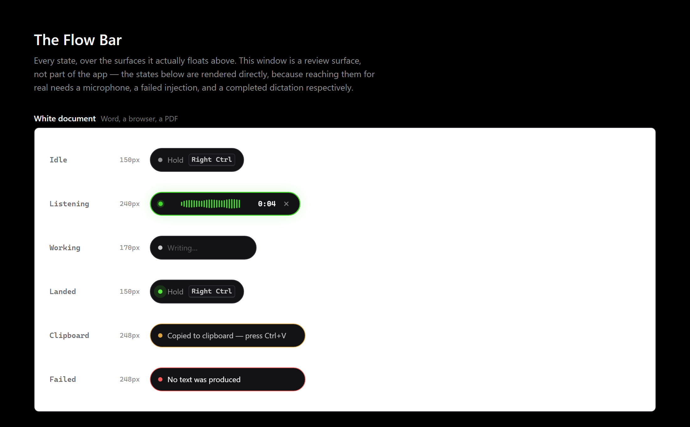
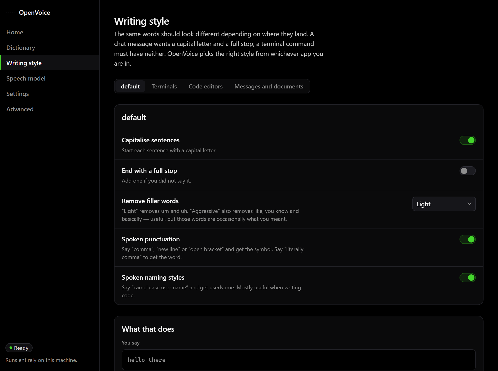
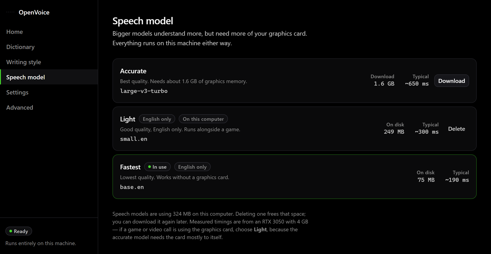
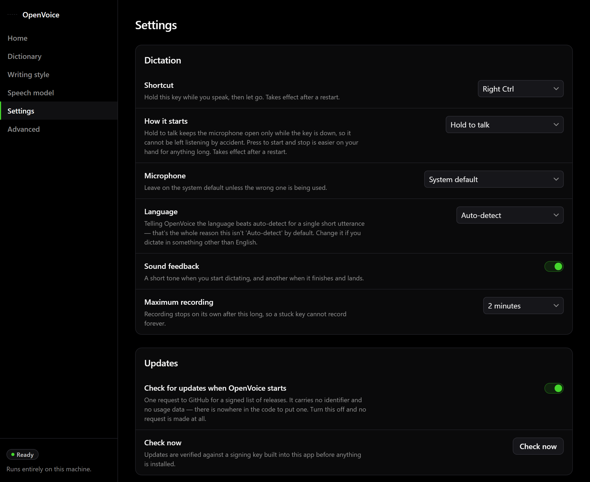
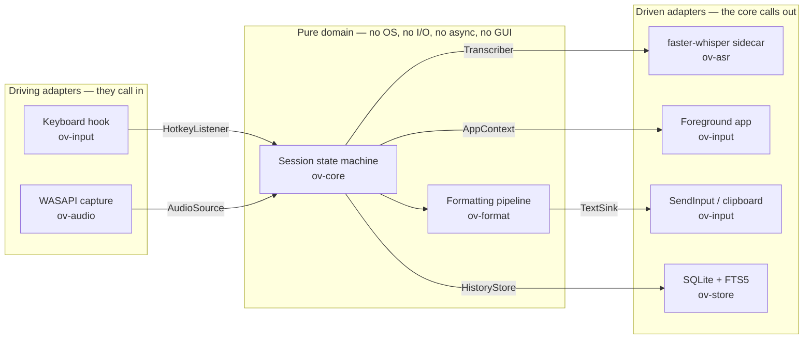
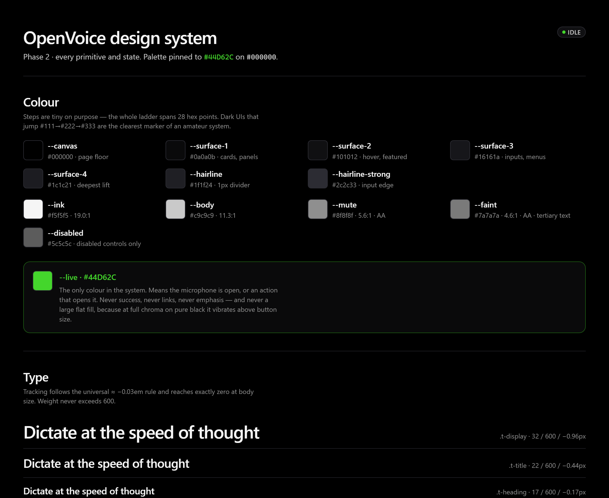

<div align="center">

# OpenVoice

**Local-first voice dictation.**
Hold a key, speak, release — correctly formatted text appears at your cursor, in any app.
No cloud, no account, no telemetry.

[](https://github.com/adityashelke04/OpenVoice/releases)
[](https://github.com/adityashelke04/OpenVoice/actions/workflows/ci.yml)
[](LICENSE)

[](https://openvoice-dictation.vercel.app)

**[openvoice-dictation.vercel.app](https://openvoice-dictation.vercel.app)**

**[⬇ Download for Windows](https://github.com/adityashelke04/OpenVoice/releases/download/download/OpenVoice-x64-setup.exe)** — one `.exe`, speech engine included.
[All releases →](https://github.com/adityashelke04/OpenVoice/releases) · [Docs](https://openvoice-dictation.vercel.app/docs) · [Changelog](https://openvoice-dictation.vercel.app/changelog)


</div>

> **Status: alpha.** It runs end to end — hotkey, capture, transcription,
> formatting, injection, and history all work on Windows, and `v0.4.2` is
> published as a pre-release you can install today. What is not done is
> distribution polish: nothing is code-signed, so Windows will warn you about an
> unknown publisher, and the bundled speech engine is CPU-only.

---

<div align="center">

<br>
<sub>Home. Your speaking speed is measured from how long you actually spoke, not
from wall-clock time, and placed against the 40 wpm typing baseline — because the
alternative to dictating is typing, not silence. The figures here are fixture
data; see <a href="#design">Design</a>.</sub>
</div>

---

## Why

Most people speak around 150 words a minute and type around 40. That gap is the
entire reason dictation exists, and the reason almost nobody uses it is that raw
transcription is not writing. It gives you your filler words, no punctuation you
did not say out loud, and no idea which app you were talking into.

Whisper transcribes beautifully and formats nothing. Ask it to transcribe someone
writing code and you get `use effect` for `useEffect`, `cube control` for
`kubectl`, the literal words "open parenthesis", and `Git status.` — capitalized,
punctuated, and unrunnable.

Those aren't model bugs. They're accurate transcriptions of what you actually said.
Fixing them is a text-processing problem, and text processing is deterministic,
testable, and improvable one rule at a time.

**So OpenVoice treats the speech model as a swappable commodity and puts all its
effort into what happens next.** That's the whole bet.

```
you say:   "um so we need to call use effect here comma then return null"
you get:   "So we need to call useEffect here, then return null"

you say:   "cube control get pods"          (in a terminal)
you get:   "kubectl get pods"               (no capital, no period — it runs)
```

Both of those are real output from `ov format`, not an illustration — they are
asserted as tests in [`crates/ov-format/src/lib.rs`](crates/ov-format/src/lib.rs).
You can run the formatter yourself without a microphone, a GPU, or the GUI:

```sh
cargo run -p ov-cli -- format "um so we need to call use effect here comma then return null"
cargo run -p ov-cli -- format "cube control get pods" --profile terminal --trace
```

It works the same in an email, a chat box, a document or a terminal. What changes
is how it formats: OpenVoice knows which app has focus and applies the rules that
app deserves.

## What it looks like

One window and one floating pill. The window is where you teach it; the pill is
the only part you see while you work.

<div align="center">

<br>
<sub><b>The formatter, rule by rule.</b> Every stage the sentence passed through
and what it looked like after each one. When a transcript comes out wrong this
turns "the dictation is bad" into the name of the rule that did it — and it is
the same trace <code>ov format --trace</code> prints in a terminal.</sub>
</div>

<br>

<div align="center">

<br>
<sub><b>Dictionary.</b> Type what OpenVoice wrote, and watch the rules run on it.
The corrections below are the ones it ships with; add your own and the box above
changes as you type.</sub>
</div>

<br>

<div align="center">

<br>
<sub><b>The Flow Bar</b>, every state, over a white document — one of the four
backdrops it is reviewed against, because a border that reads on black and
disappears on white is a defect worth catching before you ship it.</sub>
</div>

<details>
<summary><b>Writing style, Speech model and Settings</b></summary>

<br>

<div align="center">

<br>
<sub>The same words should look different depending on where they land. Four sets
of rules, and OpenVoice picks one from whichever app has focus — a chat message
gets a capital letter and a full stop, a terminal command gets neither.</sub>
</div>

<br>

<div align="center">

<br>
<sub>Described by what they cost you, not by their identifiers. The catalogue is
<a href="crates/ov-asr/src/catalog.rs"><code>ov-asr/src/catalog.rs</code></a>, the
one place those sizes exist; the timings are measured on the reference machine
named in the paragraph underneath them.</sub>
</div>

<br>

<div align="center">

<br>
<sub>Nothing here is decorative. Transcript redaction, audio retention, toggle
activation and the recording limit were all controls with nothing behind them
until v0.2.0; each now does what it says.</sub>
</div>

</details>

## Principles

1. **Local by default, network by exception.** OpenVoice makes exactly two kinds of
   outbound request, and both are listed here: a **model download you asked for**,
   and an **update check you can switch off** (Settings → Updates). Nothing else.
   Every crate that touches your microphone, your transcripts, your keyboard or
   your history is *sealed*: it has no path to an HTTP client, TLS stack or socket
   library anywhere in its dependency graph. That is
   [checked in CI](scripts/check-no-network.sh), not just promised here.

   Two honest caveats. The Tauri shell links `reqwest` transitively, because Tauri
   does, so an HTTP client is present in the binary even though no OpenVoice code
   calls it. And the update check is a genuine exception to "you asked for it" —
   nobody asks to be told about a release. It fetches one signed manifest, carries
   no identifier and no usage data, never installs anything on its own, and makes
   no request at all when turned off. The reasoning, including why it defaults on,
   is in [ADR 0005](docs/adr/0005-in-app-updates.md).

   The CI job names every permitted network dependency in an allow-list, so a new
   one cannot appear quietly — telemetry or a crash uploader still fails the build.
2. **Never lose a word.** If injection fails, the text is still on your clipboard and
   in your history. A failure is recoverable, never a silent drop.
3. **Invisible when idle.** ~60 MB RAM, ~0% CPU. You should never notice it running.
4. **Deterministic where it can be.** Formatting is rule-based and unit-tested.
   Probabilistic parts are isolated behind seams.
5. **Your data is yours.** History is a plain SQLite file at
   `%APPDATA%\OpenVoice\history.db` with a [documented
   schema](crates/ov-store/src/schema.rs) — open it with any SQLite browser, no
   export feature required. (A built-in export is v0.3 work.) Recorded audio is
   not kept unless you ask for it: the only copy that touches disk is a temporary
   WAV handed to the speech engine, deleted the moment the decode returns.
   Turning on *Keep recordings* — off by default, and there to diagnose a
   transcription problem — writes them to `%APPDATA%\OpenVoice\audio` instead,
   where they are cleared after a week. Secrets matching
   `privacy.redact_patterns` are stripped from history and logs either way.

## How it works

```
  Right Ctrl ──► capture ──► Whisper ──► format ──► inject at caret
   (held)        16 kHz       local       rules        SendInput /
                  mono      GPU or CPU   pipeline      clipboard
```

Built as [ports and adapters](docs/adr/0001-hexagonal-architecture.md): the domain
core has no dependency on the OS, audio, the GPU, or the GUI. Everything
platform-specific sits behind one of six traits.

That isn't architecture for its own sake. It means the formatting rules — the part
that actually determines whether this tool is good — can be tested in milliseconds
with no microphone, no GPU, and no window manager. A rule change is verified in a
second instead of by launching a GUI and talking to it.

The boundary is enforced mechanically: CI compiles the core crates for
`wasm32-unknown-unknown`, a target where none of those dependencies can link.



The six labelled edges are the entire contract surface — every trait is
declared in [`ov-core/src/ports.rs`](crates/ov-core/src/ports.rs), and nothing
reaches the operating system except through one of them. Adding a seventh
requires an ADR.


| Crate | Role |
|---|---|
| `ov-core` | Session state machine, the six ports, events, config. **Pure.** |
| `ov-format` | Formatting pipeline, dictionary, voice commands. **Pure.** |
| `ov-audio` | WASAPI capture via cpal; downmix and resample to 16 kHz mono |
| `ov-asr` | Supervises the speech sidecar and owns its process lifetime |
| `ov-input` | Keyboard hook, text injection, foreground app detection |
| `ov-store` | SQLite history with FTS5 search |
| `ov-cli` | `ov` — the same pipeline, headless. The integration harness |
| `ov-app` | `openvoice` — the Tauri shell, and the composition root |
| `sidecar/` | faster-whisper, as a supervised child process (frozen for release) |

Full design: [`docs/ARCHITECTURE.md`](docs/ARCHITECTURE.md). Decisions and their
rationale: [`docs/adr/`](docs/adr/).

### Measured on the reference machine

RTX 3050 Laptop (4 GB VRAM), Ryzen 5 6600H:

| | |
|---|---:|
| Model load, warm cache | 1.4 s |
| Decode, ~5 s utterance, `base.en` | ~190–600 ms |
| Realtime factor | ~27× |

Two findings from bringing this up, both now handled in code and worth knowing if
you hit them elsewhere:

- **pip-installed CUDA libraries aren't on the Windows DLL search path.** ctranslate2
  reports a healthy GPU, loads the model, then fails at the *first decode* with
  `Library cublas64_12.dll is not found`. `engine.register_cuda_dll_dirs()` fixes it.
- **`huggingface_hub` revalidates cached models over the network**, and blocked for
  **171 seconds** per load before falling back to the cache it already had. The
  tell was that the delay repeated to the millisecond — compute does not do that,
  a network timeout does. Offline mode is now the default and is lifted only for
  the duration of a download the user asked for.

## Requirements

- Windows 10/11 (macOS and Linux planned for v0.5)
- ~250 MB disk for the app — most of it the bundled speech engine — plus the model
  you choose (148 MB to 1.6 GB)
- An NVIDIA GPU with ≥2 GB VRAM is optional but makes the large model practical.
  See the note under [Installing](#installing) about what the installer ships.

Building from source needs considerably more: the Rust toolchain, MSVC build
tools, and a Python environment come to roughly 16 GB. See
[`CONTRIBUTING.md`](CONTRIBUTING.md) if that is a problem — it can all be
relocated to another drive.

## Installing

Download **[`OpenVoice-x64-setup.exe`](https://github.com/adityashelke04/OpenVoice/releases/download/download/OpenVoice-x64-setup.exe)** and run it. That link always
serves the newest build — it is deliberately not tied to a version number, because
a hand-written one goes stale the moment a release ships without someone
remembering to edit it. The [releases page](https://github.com/adityashelke04/OpenVoice/releases)
has the version history.

Nothing to configure, no Python to install — the speech engine is inside the
installer. On first launch it downloads the `base.en` weights (~150 MB), with
progress shown in the app; everything after that works offline. If that first
download fails — a dropped connection, a network that blocks `huggingface.co` —
the app says so and offers **Try again**, and the Models screen can fetch the
weights whether or not the engine came up.

Then hold **Right Ctrl**, speak, and release.

Two things worth knowing before you install:

- **The installer is not code-signed.** Windows SmartScreen will warn about an
  unknown publisher, and you will have to click *More info → Run anyway*. A
  certificate is on the v0.5 roadmap. Because you are being asked to override
  that warning, every release ships a SHA-256 beside the installer and is built
  by a public [GitHub Actions run](.github/workflows/release.yml) from the
  tagged commit — so you can check that what you downloaded is what CI built:

  ```powershell
  Get-FileHash .\OpenVoice-x64-setup.exe -Algorithm SHA256
  ```

  Compare that against the hash in the release notes and the `.sha256` file
  published next to the installer.
- **The bundled speech engine is CPU-only.** The CUDA libraries are 1.9 GB — 88%
  of the dependency tree — and useless without an NVIDIA GPU, so they are not
  shipped. An installed copy runs on the CPU, which works everywhere but is
  markedly slower on the large model. To use the GPU today, run from source.

To uninstall, use Windows *Add or remove programs*. Your history
(`%APPDATA%\OpenVoice\history.db`) and downloaded models
(`%APPDATA%\OpenVoice\models`) are yours — delete that folder if you want them
gone too.

## Building it yourself

```powershell
# 1. Rust + MSVC build tools (Windows needs the C++ workload, not just VS Code)
winget install Rustlang.Rustup
winget install --id Microsoft.VisualStudio.2022.BuildTools `
  --override "--quiet --add Microsoft.VisualStudio.Workload.VCTools --includeRecommended"

# 2. The ASR sidecar, in a virtualenv managed by uv (astral.sh/uv).
#    Drop the two nvidia packages for a CPU-only setup.
winget install astral-sh.uv
uv venv
uv pip install -e sidecar nvidia-cublas-cu12 nvidia-cudnn-cu12

# 3. Frontend dependencies. This also installs the Tauri CLI used in step 5.
npm --prefix apps/ui ci

# 4. Run the tests
cargo test --workspace

# 5. Run it, against the Python sidecar in your checkout
cd crates/ov-app
node ../../apps/ui/node_modules/@tauri-apps/cli/tauri.js dev
```

The first run downloads the `base.en` weights (~150 MB) before the window becomes
usable; the progress is shown in the app.

That sequence builds the full Windows app. You do not need any of it to work on
the parts that matter most: `ov-core` and `ov-format` are pure Rust and build and
test on any platform, with no MSVC, no GPU, and no microphone.

```sh
cargo test -p ov-core -p ov-format
```

### Producing an installer

The installer has to carry a speech engine, because the machine it lands on has
no Python. `build-sidecar.ps1` freezes the sidecar into a standalone folder that
`tauri build` then bundles as a resource:

```powershell
pwsh scripts/build-sidecar.ps1 -Clean       # ~175 MB, verifies itself on the protocol
cd crates/ov-app
node ../../apps/ui/node_modules/@tauri-apps/cli/tauri.js build
```

The freeze must run first. Tauri's own resource step does not care whether the
folder has anything in it, so without the freeze the build would happily produce
an installer with no speech engine inside — a failure that only surfaces when a
user runs the app. Two guards exist for that: `crates/ov-app/build.rs` refuses a
release build when the frozen executable is missing, and the [release
workflow](.github/workflows/release.yml) asserts it independently before
bundling.

Details and troubleshooting: [`CONTRIBUTING.md`](CONTRIBUTING.md).

## Privacy, stated plainly

**OpenVoice installs a global keyboard hook and can synthesize keystrokes.** Those are
the same capabilities a keylogger has. You should be suspicious of any program that
wants them, including this one.

What we do about that:

- The hook stores nothing. It compares a virtual key code against your configured
  chord and discards the event. [Read it yourself](crates/ov-input/).
- Audio lives in RAM. The one exception, stated plainly: the speech engine runs as a
  separate process, and the audio reaches it as a temporary WAV under
  `%TEMP%\openvoice\`, deleted immediately after the decode — success or failure.
  Nothing else writes audio to disk, and there is no retention path today.
- No telemetry, no analytics, no crash uploads — not "off by default", **absent from
  the codebase**, with a CI job that keeps it that way.
- The update check is the one request you did not individually ask for. It fetches a
  single signed manifest, sends no identifier and no usage data, and never installs
  anything without you pressing a button. Turning it off in Settings → Updates means
  no request is made — not that one is made with a flag attached.
- Releases are built by public GitHub Actions from a tagged commit, with a
  SHA-256 published beside the installer so you can verify what you downloaded.
  Every release is also signed with a minisign key whose public half is compiled
  into the app, and an update that fails that check is discarded without running.
  The [build log](https://github.com/adityashelke04/OpenVoice/actions/workflows/release.yml)
  for every release is public.

Found something wrong? [`SECURITY.md`](SECURITY.md).

## Roadmap

| | | |
|---|---|---|
| **v0.1** | Walking skeleton | hotkey → capture → transcribe → inject → history ✅ |
| **v0.2** | The differentiator | formatting pipeline, dictionary, app profiles, settings UI ✅ |
| **v0.3** | Feel | overlay waveform ✅, sound feedback ✅, history search ✅ — still to do: streaming partials, history export, sub-700 ms p50 |
| **v0.4** | Intelligence | optional local LLM polish, prompt mode for AI agents |
| **v0.5** | Distribution | published Windows installer ✅, auto-update ✅ — still to do: code signing, optional GPU pack, macOS |
| **v1.0** | Stability | plugin API for formatter rules, frozen API |

Every phase ships something usable. None is a refactor-only phase.

Nothing in the settings is decorative any more. Transcript redaction, audio
retention, toggle activation and the maximum-recording limit were all fields or
toggles with no implementation behind them until v0.2.0; each now does what it
says.

## Design

One accent colour, `#44D62C`, and it means exactly one thing: the microphone is
open. Never success, never links, never emphasis. The surface ladder spans 28 hex
points end to end, because a dark UI that jumps `#111 → #222 → #333` is the
clearest marker of a system nobody thought about.

<div align="center">

</div>

The whole system is a live page rather than a document. It needs no Rust and no
Windows — the frontend runs standalone in any browser:

```sh
npm --prefix apps/ui ci
npm run dev:ui          # then open http://localhost:5199/?window=sheet
```

`?window=hub` is the main window, `?window=overlay` is the Flow Bar on its own,
and `?window=flowbar` is every Flow Bar state at once, over the four kinds of
surface it has to stay legible against.

Every screenshot in this README is captured from that same running UI by
[`scripts/screenshots.mjs`](scripts/screenshots.mjs), so none of them can drift
from the interface it claims to show. What the screens are *reading* is fixture
data from [`scripts/screenshot-fixtures.mjs`](scripts/screenshot-fixtures.mjs) —
the dictionary, profiles and model catalogue copied from the Rust sources they
mirror, the history rows taken from tests in `ov-format`, and one invented
month's worth of totals. Nothing here is a mocked component or a drawing of a
screen: the real `Hub` renders against the real `invoke` boundary, and only the
far side of it is canned. That is also why these are safe to recapture — the
previous versions came off a live machine and published whatever had last been
dictated into it.

## Contributing

The pure crates are the easiest place to start, and they are also where the
interesting work is. `ov-core` and `ov-format` need no Windows, no GPU, no
microphone and no MSVC — `cargo test -p ov-core -p ov-format` is the whole setup. A
new formatting rule is about thirty lines plus two tests: one that would fail
without it, and one proving it does not fire when it shouldn't.

Good first things to look at: a missing term in
[`dictionary.rs`](crates/ov-format/src/dictionary.rs) (Whisper mistranscribes some
tool name you use — add what it actually hears), a voice command in
[`rules.rs`](crates/ov-format/src/rules.rs), or an app profile for an editor nobody
has covered yet. Setup, the boundary rules, and how to write a rule that behaves:
[`CONTRIBUTING.md`](CONTRIBUTING.md).

## Prior art

[Wispr Flow](https://wisprflow.ai) and [superwhisper](https://superwhisper.com) are
excellent and worth paying for. OpenVoice exists because I wanted something local,
open, and tuned specifically for writing code and prompting agents.

Built on [faster-whisper](https://github.com/SYSTRAN/faster-whisper),
[CTranslate2](https://github.com/OpenNMT/CTranslate2), and
[Whisper](https://github.com/openai/whisper).

> **Name note:** [MyShell's OpenVoice](https://github.com/myshell-ai/OpenVoice) is an
> unrelated and well-known text-to-speech project. No affiliation. A rename is under
> consideration.

## License

[Apache-2.0](LICENSE).
