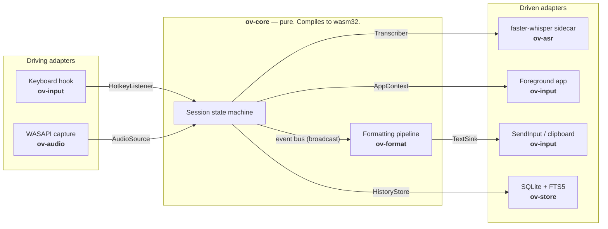
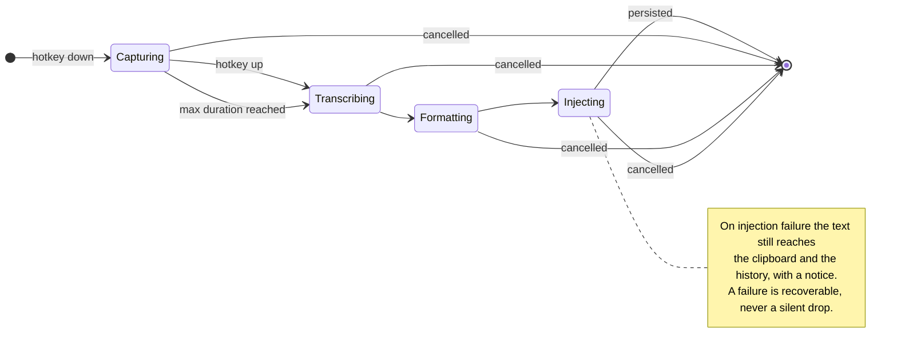

# OpenVoice — System Design

> Owner: @adityashelke04 · Last reviewed against the code: 2026-08-03
>
> The single source of truth for architecture: every module has an explicit
> contract and every decision has a rationale. Where a design has since been
> reversed by measurement or by contact with reality, the original reasoning is
> kept and the reversal is noted inline — the wrong turns are frequently the most
> useful part.
>
> **Reading this alongside the code.** Sections marked **planned** describe
> intent, not shipped behaviour; everything else has been checked against the
> current tree. Start with §2 (the shape), then §6 if you want to work on the
> formatter — which is where most of the interesting work is.
>
> The four architectural decisions that shaped all of this are recorded
> separately, with their rejected alternatives, in [`adr/`](adr/).

---

## 1. Product definition

**One line:** OpenVoice is a local-first, open-source push-to-talk dictation tool that
turns speech into *correctly formatted developer text* at your cursor, in any
application, with sub-second latency and zero network calls.

**The job to be done.** A developer is in VS Code / Cursor / a browser / a terminal.
They hold a key, speak a sentence — a commit message, a prompt to an AI agent, a
Slack reply, a code comment, a variable name — release the key, and the text appears
where the caret was. No window switching, no copy-paste, no cloud.

### 1.1 Why this is not "just Whisper"

Raw Whisper output is unusable for developers. It writes `use effect` instead of
`useEffect`, `cube CTL` instead of `kubectl`, `open parenthesis` as literal words,
and capitalizes shell commands. **The formatting pipeline is the product**; the ASR
model is a swappable commodity. This inverts the usual instinct to spend all the
effort on the model, and it is the central architectural bet of this project.

### 1.2 Explicit non-goals (v1)

| Not doing | Why |
|---|---|
| Real-time streaming captions / subtitles | Different latency contract, different UX. Separate product. |
| Speaker diarization, meeting transcription | Not the job. Would drag in a whole feature surface. |
| Cloud sync of history | Contradicts local-first. Users can sync `%APPDATA%` themselves. |
| Voice *control* of the OS ("open Chrome") | Scope explosion; different risk profile. |
| Any paid API, any account, any telemetry | Hard product constraint. |
| Mobile | Out of scope. |

### 1.3 Product principles

1. **Local by default, network by exception.** The only outbound request the app may
   ever make is an explicit, user-initiated model download. Enforced in code (§9.2),
   not just by convention.
2. **Never lose a word.** If injection fails, the transcript still lands in history
   and on the clipboard. A failed transcription is a recoverable event, never a
   silent drop.
3. **Zero-friction hot path.** Idle cost must be negligible (< 60 MB RAM, ~0% CPU).
   The app is always running; it must never be something you notice.
4. **Deterministic where it can be.** Formatting is rule-based and unit-testable.
   Probabilistic components (ASR, optional LLM) are isolated behind seams so their
   output can be golden-tested and their failures contained.
5. **The user owns their data.** Plain SQLite in a folder they can open, copy or
   delete; a documented schema (§9.1); audio never persisted. A one-click export is
   v0.3 work — until then the file itself is the export.

---

## 2. Architecture overview

### 2.1 Style: hexagonal (ports & adapters)

The domain core — the recording session state machine and the formatting pipeline —
has **no dependency on the OS, on audio libraries, on the GUI, or on the ASR
runtime**. Everything platform-specific lives in an adapter behind a trait.

This is not architecture astronautics. It buys three concrete things:

- The formatter and state machine are testable in milliseconds with no audio device,
  no GPU, and no window manager. That is what makes daily iteration cheap.
- Swapping ASR runtimes (whisper.cpp → faster-whisper → Parakeet → a future model)
  is a new impl of one trait, not a refactor.
- macOS/Linux support later becomes "write three adapters", not "rewrite the app".



### 2.2 The six ports (the entire contract surface)

```rust
// crates/ov-core/src/ports.rs  — the ONLY way core talks to the world.

/// Observes the dictation chord globally, without stealing focus.
pub trait HotkeyListener: Send + Sync {
    fn start(&self, sink: HotkeySink) -> Result<()>;   // Arc<dyn Fn(HotkeyEvent)>
    fn rebind(&self, chord: &Chord) -> Result<()>;
    fn stop(&self) -> Result<()>;
}

/// Captures the microphone and normalizes to 16 kHz mono. The adapter owns
/// downmixing, resampling and device selection.
pub trait AudioSource: Send + Sync {
    fn start(&self, levels: Arc<dyn Fn(LevelFrame) + Send + Sync>) -> Result<()>;
    fn stop(&self) -> Result<Pcm16k>;                  // everything since start
    fn abort(&self) -> Result<()>;
    fn devices(&self) -> Result<Vec<String>>;
}

/// Speech -> text. Impls: FasterWhisperSidecar (v0.1), WhisperCpp (planned), Mock.
pub trait Transcriber: Send + Sync {
    fn warm(&self) -> Result<()>;                      // preload weights
    fn transcribe(&self, audio: &Pcm16k, hint: &DecodeHint) -> Result<Transcript>;
    fn model_id(&self) -> String;                      // recorded in history
}

/// Puts text where the caret is. Impl: WinTextSink (picks keystrokes or paste).
pub trait TextSink: Send + Sync {
    fn inject(&self, text: &str, mode: InjectMode) -> Result<InjectReceipt>;
}

/// Identifies the foreground app so a profile can be selected.
pub trait AppContext: Send + Sync {
    fn foreground(&self) -> Result<ForegroundApp>;     // exe, title
}

/// Durable local storage. Impl: SqliteStore.
pub trait HistoryStore: Send + Sync {
    fn append(&self, entry: &Utterance) -> Result<i64>;
    fn search(&self, query: &str, limit: usize) -> Result<Vec<Utterance>>;
    fn purge_older_than(&self, days: u32) -> Result<u64>;
}
```

Two things about these signatures are deliberate and worth not undoing:

- **No channel types, and no `async`.** Inbound ports push through callbacks
  instead of returning a `Receiver`, and nothing here is a future. Either would
  drag a specific async runtime into `ov-core`, and a runtime cannot link on
  `wasm32` — so the purity check in CI would fail, which is exactly what it is for.
  Adapters use whatever channels and threads they like internally.
- **Everything is blocking.** `transcribe` takes several hundred milliseconds and
  runs on the engine's own thread, not the UI's. Making it `async` would buy
  nothing and cost the property above.

**Rule:** if a new feature wants to reach the OS, it either uses one of these six or
adds a seventh port with an ADR. No ad-hoc `#[cfg(windows)]` inside core. Ever.

### 2.3 Repository layout

```
openvoice/
├── crates/
│   ├── ov-core/        # domain: FSM, events, config types, ports. NO os/io deps.
│   ├── ov-format/      # formatting pipeline + dictionary + voice commands (pure)
│   ├── ov-audio/       # cpal/WASAPI capture, downmix, resample to 16 kHz mono
│   ├── ov-asr/         # supervises the speech sidecar; owns its process lifetime
│   ├── ov-input/       # low-level keyboard hook + text injection + foreground app
│   ├── ov-store/       # SQLite (rusqlite, bundled) history + FTS5 + migrations
│   ├── ov-cli/         # `ov`: the same pipeline, headless. Integration harness.
│   └── ov-app/         # `openvoice`: Tauri binary, composition root, IPC
├── apps/ui/            # React + TS + Vite: the hub window and the Flow Bar overlay
├── sidecar/            # the Python speech engine (faster-whisper) and its protocol
├── scripts/            # freeze the sidecar, the no-network check, screenshots
├── docs/
│   ├── ARCHITECTURE.md # this file
│   └── adr/            # 0001-...md  immutable decision records
├── fixtures/audio/     # working WAVs for manual ASR checks. Gitignored: they are
│                       # real recorded speech and do not belong in a public repo.
├── .github/workflows/  # ci.yml, release.yml
└── Cargo.toml          # workspace
```

`ov-core` and `ov-format` must compile to `wasm32-unknown-unknown` with no features.
That is a mechanically-checked proof (in CI) that the purity boundary hasn't leaked.

---

## 3. The session state machine

The single most important piece of correctness in the app. Modeled explicitly as a
typestate-ish enum, not as a pile of booleans.

A session moves through four phases (`session::Phase`); "idle" is the absence of
any session rather than a fifth variant.



`[*]` is idle on both sides. Every arrow back to it emits exactly one
`Effect::Persist`; every `cancelled` arrow is an `Input::Cancelled` arriving from
any phase.

**Concurrency.** Capture is concurrent; everything after it is serialized. The
machine holds at most one live capture plus an *ordered queue* of post-capture
sessions, so holding the hotkey again while the previous utterance is still
decoding queues the new one rather than dropping, interleaving, or reordering it.

**Invariants (each enforced by a test at the bottom of `session.rs`):**

1. Every session that starts produces **exactly one** `Effect::Persist`. No path —
   success, cancel, silence, or failure — can exit without accounting for the audio.
2. `Input::Cancelled` from any phase drains the machine back to idle.
3. A session never reaches injection without having been formatted first.
4. Key auto-repeat cannot start a second capture.
5. A stuck key cannot record past `max_duration_ms` (default 120 s).

Recordings shorter than `min_duration_ms` (default 300 ms) are discarded as
fat-finger presses, silently — a toast for something the user did not mean to do is
noise.

### 3.1 Latency budget (target, 10 s utterance, RTX 3050)

These are the per-stage budgets encoded in `event::Stage::budget_ms`, not measured
averages. The sub-700 ms p50 they add up to is a v0.3 goal.

| Stage | Budget | Notes |
|---|---:|---|
| Hotkey release → capture stop | 10 ms | hook thread does nothing but post a message |
| Finalize + VAD trim | 25 ms | already 16 kHz mono; trim leading/trailing silence |
| ASR decode (`large-v3-turbo`, CUDA) | 600 ms | ~15–25× realtime on this GPU |
| Format pipeline | 5 ms | pure string work, no allocation storms |
| Injection (clipboard path) | 120 ms | dominated by target app's paste handler |
| **Total (p50)** | **~700 ms** | perceived as "instant enough" |

Every stage already emits an `Event::Timing` carrying its measured duration, so the
data is on the wire today. **Planned:** the debug panel that renders the last 50
sessions as a stacked bar. Currently the UI keeps only the end-to-end figure. The
instrumentation went in from day one on purpose — retrofitting latency measurement
into a shipped app never happens.

---

## 4. Audio pipeline

- **Capture:** `cpal` → WASAPI shared mode, native device rate, mono downmix.
  `cpal::Stream` is `!Send` on Windows, so a dedicated thread owns the stream for
  its whole life and is driven by commands over a channel.
- **Resample:** `rubato` (sinc) to exactly 16 kHz f32. Whisper's contract.
- **Buffering:** the capture callback appends into a `Vec` behind a mutex, which
  `stop()` takes whole. A lock-free SPSC ring was the original plan and remains the
  right answer if the callback ever shows up in a profile; it does not today, at
  16 kHz mono with a 20 ms callback.
- **The stream is open only while the key is held.** The original design kept the
  device recording continuously so the ~200 ms before the hotkey registered could
  be retained, defeating the clipped-first-syllable problem. **That was dropped**,
  and the reason is worth keeping: continuous recording contradicts the central
  privacy property of push-to-talk, and would leave Windows' own microphone
  indicator lit whenever OpenVoice was running. Opening on press costs 10–30 ms of
  WASAPI startup, against which human reaction time is generous — and in exchange
  the operating system's indicator becomes an *independent* confirmation of the
  guarantee. `SessionLimits::preroll_ms` is a leftover of that design and is
  currently unread.
- **VAD:** performed inside the speech engine, not here. faster-whisper's built-in
  Silero VAD filter (`vad_filter=True`) trims silence before decode and reports
  `duration_after_vad`, which the sidecar uses to reject an utterance that turned
  out to be nothing but room tone. There is no VAD in `ov-audio`, and hands-free
  auto-stop (which would need one) is not implemented.
- **Level meter:** RMS + peak per callback, sent to the overlay at roughly 30 Hz for
  the waveform. The overall RMS of a finished capture also drives the "your mic is
  muted / nothing was heard" warning, which is otherwise a baffling failure mode.

---

## 5. ASR layer

### 5.1 Model selection for 4 GB VRAM

Three presets ship, defined in `sidecar/openvoice_asr/engine.py::MODEL_PRESETS`.
Adding a fourth is a dict entry, not a code change.

| Preset | Compute type | Size on disk | VRAM | Role |
|---|---|---:|---:|---|
| `base.en` | `int8` | ~75 MB | CPU-ok | **Installed default.** Mediocre accuracy, but instant on any machine. |
| `small.en` | `float16` → `int8_float16` | ~250 MB | ~0.6 GB | Low-VRAM / battery profile |
| `large-v3-turbo` | `float16` → `int8_float16` | ~1.6 GB | ~1.6 GB | Best accuracy, opt-in upgrade |

The arrow is a fallback: `float16` is tried first and `int8_float16` is used only
if the larger weights will not fit, because a 4 GB laptop GPU also has a desktop
compositor and a browser on it. `float16` is preferred despite being bigger
because it measured *faster* here — a median 623 ms decode against
`int8_float16`'s 661 ms, and half the load time (3.7 s vs 7.2 s), with
byte-identical transcripts. Int8 weights have to be dequantized on every forward
pass, and on a GPU that costs more than the memory bandwidth it saves.

> **Corrected on 2026-08-02.** This originally shipped `large-v3-turbo` as the
> default with a plan to prompt an upgrade *from* `base.en` in the background —
> that upgrade prompt was never built, and the plain default landed as
> `large-v3-turbo` instead. Distribution turned out CPU-only (see ADR 0003's
> outcome note), which makes `large-v3-turbo` the heaviest model on the slowest
> path: a 1.6 GB download for worse-than-necessary latency. `base.en` is now the
> actual default in `crates/ov-app/src/settings.rs`; upgrading is a Models-screen
> action, not a background surprise.

### 5.2 Decode hints — tried, measured, and turned off

> **Reversed on 2026-08-01 by measurement.** This section originally argued that
> seeding Whisper's `initial_prompt` with the user's vocabulary was "strictly better
> than fixing them afterwards", because the decoder still has acoustic evidence that
> post-processing has discarded. The reasoning was sound. The result was not.

A/B on identical audio and model, the hint being the only variable:

```text
with hint:     camelCaseUserProfile ==NewUserProfile open paren close paren
without hint:  camel case user profile equals new user profile open paren close paren
```

A prompt full of camelCase identifiers does not merely teach the model those words —
it teaches it that **this speaker writes camelCase**, so it welds ordinary spoken
words together. That destroys the voice commands ("camel case", "equals") the
formatting pipeline depends on, and nothing downstream can recover words the model
has already joined.

The benefit it was supposed to buy is one the dictionary already delivers: `use
effect` → `useEffect` is a post-processing fix, and a reliable one. So the mechanism
loses on both sides of the trade.

**Decision: hints are off by default.** The plumbing stays (`DecodeHint`, `--hint`)
because genuinely unguessable proper nouns may still justify it, but it is opt-in and
must be re-measured before it is ever made default again.

**The general lesson, worth keeping:** this was a plausible, well-argued design that
survived review and was written into three files before anyone ran it. It took one
A/B test to overturn. Prefer the experiment to the argument.

### 5.3 Model manager

This is the app's one network surface, so it is worth describing exactly rather
than approximately.

Weights are fetched from Hugging Face by `huggingface_hub`, inside the sidecar —
the Rust side never opens a socket, which is what lets every Rust crate stay
*sealed* under `scripts/check-no-network.sh` (§9.2). The host asks over the
protocol (`ensure_model`), the sidecar reports byte progress as interim messages,
and the download resumes from where it stopped if the connection drops. Integrity
is whatever `huggingface_hub` enforces on its own transfers; **there is no
SHA-256 manifest committed to this repository, and no independent hash check
before load.** An earlier draft of this document promised one. Adding it is worth
doing and is not done.

Only the files a CTranslate2 Whisper repository actually needs are fetched
(`config.json`, `preprocessor_config.json`, `model.bin`, `tokenizer.json`,
`vocabulary.*`). Downloading the whole repository would also pull PyTorch weights
this engine never reads, roughly doubling the transfer.

An installed copy stores weights under `%APPDATA%\OpenVoice\models`, so
uninstalling reclaims the space. A development checkout leaves the shared Hugging
Face cache alone.

**Offline is the default, and this matters more than it sounds.**
`huggingface_hub` revalidates a cached model over the network on every load,
which measured at **171 seconds** per load before falling back to the cache it
already had. `enforce_offline_by_default()` sets `HF_HUB_OFFLINE` at import time,
and the `online()` context manager lifts it only for the duration of a download
the user asked for.

---

## 6. The formatting pipeline (the differentiator)

An ordered list of composable, individually-testable stages. Each implements
`fn apply(&self, doc: Doc, ctx: &Ctx) -> Doc`, where `Doc` is a token stream rather
than a string — so a later stage can see that an earlier one produced a literal
identifier and must leave it alone.

| # | Stage | Example |
|---|---|---|
| 0 | `Doc::parse` | tokenize; not a rule, but shown in the trace |
| 1 | `CollapseRepeats` | `kkkkkkkkkkkk` → `kkk`; a decoding artefact nothing downstream should have to cope with |
| 2 | `StripFillers` | "um, so like, the thing" → "the thing" (off / light / aggressive) |
| 3 | `VoiceCommands` | "new line", "new paragraph", "open paren", "semicolon", "tab" |
| 4 | `ApplyDictionary` | "use effect" → `useEffect`; "cube control" → `kubectl` |
| 5 | `CaseTransforms` | "camel case user name" → `userName`; "snake case" / "kebab case" / "screaming snake case" |
| 6 | `Capitalize` | sentence-initial caps, or force-lowercase for a shell |
| 7 | `ProfilePolicy` | trailing period, and other per-app policy |

**Planned:** an `LlmPolish` stage (local model, opt-in, off by default) for prose
cleanup. Nothing of it exists yet.

**The order is load-bearing.** Fillers go first so a stray "um" cannot break a
multi-word command match. Commands run before the dictionary so spoken punctuation
becomes literal tokens the dictionary will not try to interpret. Capitalization runs
late, after identifiers have been resolved into `Tok::Lit` tokens it is *forbidden*
to touch — capitalizing `useEffect` into `UseEffect` turns working code into a
compile error.

**Design decisions inside the pipeline:**

- **Escape hatch is mandatory.** "literally new line" emits the words. Without this,
  voice commands make certain sentences untypeable, which is infuriating.
- **Dictionary matching is exact-phrase over enumerated mistranscriptions**, with a
  longest-match window bounded by the longest entry. Whisper's errors are *phonetic*
  errors, so the entries list what the model actually produces — "cube control",
  "cube c t l", "coup control", "cube cuddle" all map to `kubectl` — rather than the
  correct pronunciation. Each spoken form is also indexed space-free, because
  Whisper often returns an identifier already welded together but miscased.
  **Considered and not built:** a phonetic index (Double Metaphone plus edit
  distance) generalizing to mistranscriptions nobody enumerated. It is the obvious
  next step if the enumerated list starts feeling like whack-a-mole.
- **Formatting must be idempotent on its own output.** History replay and any
  "preview this phrase" UI depend on it, and four real bugs were found by fuzzing
  realistic phrases through every profile twice. Any new rule inherits this
  obligation.
- **Every stage is recorded.** `format_traced` returns the text after each rule, and
  the Writing style screen renders it. "The formatter did something weird" is
  otherwise an unfalsifiable bug report; with the trace, the offending rule is
  obvious in about ten seconds.
- **Tests live beside the rules**, as ordinary `#[test]` functions in
  `rules.rs` and `lib.rs`, and run in milliseconds. (An earlier draft specified
  golden files under `fixtures/format/`; that directory was never created, and
  inline tests have turned out to be the lower-friction form for rules this small.)

### 6.1 App profiles

Keyed by executable name, matched case-insensitively, with a fallback default.
Three ship as builtins (`ov_format::profile::Profile`), seeded into the user's
settings on first run so they are edited rather than invented:

```toml
[[profiles]]
name          = "terminal"
matches       = ["WindowsTerminal.exe", "powershell.exe", "pwsh.exe",
                 "cmd.exe", "wt.exe", "alacritty.exe"]
capitalize    = "force_lower"   # `git status`, not `Git status`
end_period    = false           # a trailing period breaks a command
dictionaries  = ["shell", "code"]

[[profiles]]
name          = "editor"
matches       = ["Code.exe", "Cursor.exe", "idea64.exe", "devenv.exe",
                 "zed.exe", "sublime_text.exe"]
capitalize    = "sentence"
end_period    = false           # code comments rarely want one
dictionaries  = ["code"]

[[profiles]]
name            = "prose"
matches         = ["slack.exe", "Discord.exe", "Notion.exe", "chrome.exe",
                   "msedge.exe", "firefox.exe", "olk.exe"]
capitalize      = "sentence"
end_period      = true
fillers         = "aggressive"  # chat tolerates rewriting; code does not
case_transforms = false         # "camel case" is a phrase here, not a command
```

Every profile carries the same fields: `fillers` (`off`/`light`/`aggressive`,
default `light`), plus `voice_commands` and `case_transforms` booleans — so a
profile can turn an entire class of rewriting off without a code change. `prose` is
the one that differs most, and deliberately: it is the only surface where
"camel case" is far more likely to be two ordinary words than an instruction.

### 6.2 "Prompt mode" — a deliberate bet

A second hotkey that captures longer, rambling speech and formats it as a *prompt for
an AI coding agent*: filler stripped, restructured into an instruction, requirements
bulleted. This is precisely how you are using dictation right now, and it is the
feature most likely to make OpenVoice better than the commercial tools for this
specific audience. Requires the optional local LLM. Phase 4.

---

## 7. Text injection (Windows)

Genuinely the hardest thing to get right; it fails in different ways per target app.

| Strategy | How | Good for | Fails at |
|---|---|---|---|
| **A. `SendInput` + `KEYEVENTF_UNICODE`** | synthesize per-codepoint key events | short text, terminals, games, anything | slow above ~200 chars; some apps drop fast input |
| **B. Clipboard + `Ctrl+V`** | set clipboard, synthesize paste, restore | long text, instant regardless of length | clobbers clipboard; blocked in some secure fields; app may not honor Ctrl+V |
| **C. UI Automation `TextPattern`** *(not implemented)* | insert via accessibility API | cleanest where supported | inconsistent support; heavier |

**Chosen policy:** length-based, with restore and verification.

- `len <= paste_threshold_chars` (default **60**) → **A**, sent in small paced
  chunks. No clipboard side effects, and it works in terminals that do not accept
  `Ctrl+V` at all.
- Longer → **B**, saving *all* clipboard formats and restoring them afterwards.
  Restoring only `CF_UNICODETEXT` — which most tools do — silently destroys a
  copied image or rich text. The full format set goes back.

The threshold sits where it does because both directions fail. Too high, and
synthesized keystrokes corrupt: Windows coalesces adjacent `VK_PACKET` events when
the target cannot drain its input queue, turning `Are you the best?` into
`Are ?????????????`. Too low, and everything routes through the clipboard, which is
atomic but depends on the target honouring `Ctrl+V` and reading the clipboard
promptly — an Electron editor did neither, and text vanished while the engine
recorded "delivered".

- **The clipboard hold is 15 seconds, and the restore is conditional.** It was
  originally 1 second, chosen to give the target app time to read the clipboard.
  That is nowhere near long enough for a *person* to notice a failed paste and
  press `Ctrl+V` themselves — and worse, the restore fired even down the
  known-failure path, undoing the exact fallback the error branch had just set up.
  `should_restore` now also asks whether the paste chord actually sent, because
  "succeeded" and "failed, and the caller is using the clipboard as a safety net"
  otherwise look identical: the text is sitting on the clipboard either way.
- **Injection returns an `InjectReceipt`.** On failure — on *both* paths, short and
  long; the short one had no fallback at all until it was fixed — the text is left
  on the clipboard and a notice tells the user to press `Ctrl+V`. Never a silent
  loss.
- **Modifier hygiene:** the push-to-talk key is itself a modifier (Right Ctrl), so
  it must be released in the synthetic input stream before pasting, or `Ctrl+V`
  becomes `Ctrl+Ctrl+V` and nothing happens. This bug eats an afternoon if
  unplanned.
- **The foreground window can change mid-flight.** Transcription and formatting take
  seconds, so the window that had focus when the user started speaking is not
  guaranteed to still have it at injection time. The injector logs a warning naming
  both windows when they differ, which turns "it sometimes doesn't paste into app X"
  into one greppable log line.

---

## 8. Hotkey capture

`RegisterHotKey` is unusable here: it gives a single "pressed" notification, not
down/up, so push-to-talk is impossible. We install a **low-level keyboard hook**
(`SetWindowsHookEx(WH_KEYBOARD_LL)`) on a dedicated thread with its own message pump.

Non-negotiable constraints for that thread:
- The hook callback must return in **well under 10 ms** or Windows silently evicts
  the hook and all hotkeys stop working. It therefore does *nothing* but compare a
  key code and hand the event off. No logging, no locks, no allocation.
- Never swallow the key unless the user has explicitly bound a dedicated dictation
  key and set `exclusive`. The default is `false`, so binding to Right Ctrl cannot
  break anyone's normal shortcuts.
- **Planned:** a watchdog that re-installs the hook if Windows drops it, which
  happens after UAC prompts and some full-screen transitions. Not built; today the
  recovery is restarting the app, and `ov keytest` is the tool for telling "the
  hotkey is not reaching us" apart from every other cause.

**Default binding:** `Right Ctrl` held (push-to-talk) — rarely used, easy to reach,
not a chord. The bindable set is a closed enum (`config::Key`): Right Ctrl, Right
Alt, Right Shift, Caps Lock, F13, F14, Scroll Lock. Deliberately closed rather than
a raw virtual-key code, so the config file stays readable and nobody binds dictation
to `A`. `ActivationMode::Toggle` exists in the config schema but **no code reads it
yet**; activation is push-to-talk only.

---

## 9. Data, privacy, security

### 9.1 Storage

Everything lives under `%APPDATA%\OpenVoice\`:

| File | What it is |
|---|---|
| `settings.toml` | Config, dictionary and profiles in one document. Versioned; migrated and validated on load. Written atomically (temp file, then rename) because the dictionary represents real accumulated effort. |
| `history.db` | SQLite via `rusqlite` with `bundled` SQLite compiled in, FTS5 for search, migrations in-tree keyed off `PRAGMA user_version`. |
| `models/` | Weights, for an installed copy. A development checkout uses the shared Hugging Face cache instead. |
| `openvoice.log` | Single appending log file. **Planned:** rotation; today it grows without bound. |

An unreadable `settings.toml` is copied aside as `settings.toml.broken` rather than
overwritten — it is the only copy of whatever the user had — and the app starts on
defaults. A dictation tool that refuses to launch because one field is malformed is
worse than one that launches with a stale setting.

```sql
CREATE TABLE utterance (
  id           INTEGER PRIMARY KEY,
  created_at   INTEGER NOT NULL,   -- unix milliseconds
  duration_ms  INTEGER NOT NULL,
  raw_text     TEXT    NOT NULL,   -- straight from the model
  final_text   TEXT    NOT NULL,   -- after formatting; what was delivered
  profile      TEXT    NOT NULL,
  target_app   TEXT    NOT NULL DEFAULT '',
  window_title TEXT    NOT NULL DEFAULT '',
  model        TEXT    NOT NULL DEFAULT '',
  status       TEXT    NOT NULL,   -- Outcome::code(): delivered |
                                   -- clipboard_fallback | cancelled | too_short |
                                   -- silent | asr_failed | capture_failed
  latency_ms   INTEGER NOT NULL DEFAULT 0,
  word_count   INTEGER NOT NULL DEFAULT 0
);

CREATE VIRTUAL TABLE utterance_fts USING fts5(
  final_text, content = 'utterance', content_rowid = 'id',
  tokenize = 'unicode61 remove_diacritics 2'
);
```

Two details that are easy to get wrong and expensive to fix later:

- **FTS5 uses an external content table**, so the index stores no copy of the text —
  only pointers into `utterance`. That halves the storage and, more importantly,
  makes it impossible for the two to disagree. The cost is that the index does not
  maintain itself, hence the three triggers; without them a deleted row keeps
  matching searches forever.
- **Keeping `raw_text` alongside `final_text` is what makes the formatter
  improvable.** The entire history can be replayed through a new rule set and diffed
  before the change ships. Discard the raw text and every past session becomes
  useless as evidence.

Durability is WAL with `synchronous = NORMAL`. A dictation tool writes one small row
every few seconds; `FULL` would mean an fsync per utterance for a guarantee nobody
needs on a transcript of "hello".

### 9.2 Privacy, enforced not promised

- **No telemetry. No analytics. No crash reporting uploads.** Not configurable-off —
  simply absent from the codebase.
- **`scripts/check-no-network.sh` is a CI job, not a README sentence.** It walks
  `cargo tree --edges normal,build --target all` and enforces two distinct
  guarantees, kept separate because they are not equally strong:
  - **SEALED** — `ov-core`, `ov-format`, `ov-audio`, `ov-input`, `ov-store`,
    `ov-cli`, `ov-asr` have no path to an HTTP client, TLS stack or socket library
    anywhere in their transitive graph, build scripts included. Nothing in them can
    phone home, because nothing in them can open a socket. This is why the model
    download lives in the Python sidecar: it keeps every Rust crate sealed.
  - **NO_DIRECT** — `ov-app` links `reqwest` transitively, because Tauri depends on
    it unconditionally. The script cannot honestly claim otherwise, so it enforces
    the weaker, still-useful property instead: no OpenVoice crate names a network
    client *itself*. Telemetry, an update ping, or a crash uploader would have to
    appear as a direct dependency, and that fails the build.
- Audio is held in RAM, with the temporary-WAV exception described in §5 —
  `%TEMP%\openvoice\ov-<id>.wav`, deleted immediately after each decode.
- **Not implemented, despite having config fields:** `privacy.retain_audio`
  (nothing reads it; audio is never retained) and `privacy.redact_patterns`
  (nothing applies it; transcripts reach history and logs verbatim). Redaction is
  the more serious of the two and is the main open privacy gap in the project.
- **Planned:** a "panic purge" menu item that wipes history immediately.

### 9.3 Threat model (brief, honest)

The app installs a global keyboard hook and can synthesize input — the same
capabilities as a keylogger. Mitigations that matter for an OSS tool people are
asked to trust: reproducible builds, the hook stores no key data (only compares
against the bound chord), signed releases once a cert is available, and a
`SECURITY.md` with a disclosure path. Documented plainly in the README rather than
buried, because users *should* be suspicious of this class of software.

---

## 10. UI

Two windows plus a tray icon. Both are the same Vite bundle, routed by query
string (`?window=hub`, `?window=overlay`) — plus `?window=sheet`, a design-system
review page that is not part of the shipped app but is reachable in a browser.

**Stack:** React 19 + TypeScript + Vite. No component library and no state
manager — the design system is hand-written CSS custom properties in
`src/styles/tokens.css`, and state is `useState` over the event stream. That is a
deliberate consequence of the frontend discipline below: a UI that holds no
business logic has very little state to manage.

**The Flow Bar** (`overlay`) — a 280×52 frameless, transparent, always-on-top,
**non-activating** pill. `WS_EX_NOACTIVATE` is applied on the Rust side after
creation. If this window ever takes focus, the caret in the user's editor is lost
and the dictated text goes nowhere — the whole product failing. The flag prevents
*focus*, not *input*, which is the only reason an interactive always-on-top overlay
is viable here: it can still be dragged and right-clicked while the editor keeps the
caret. Its Tauri capability grant is deliberately narrower than the Hub's
(`capabilities/overlay.json`), listing only the four window APIs `Overlay.tsx`
actually calls — sharing the Hub's grant meant `core:window:allow-set-focus` was
permitted on the one window that must never use it.

**The Hub** (`hub`) — six sections, all shipped:
- *Home* — live status, speaking speed against typing and average-speech baselines,
  time saved, day streak, and searchable recent dictations with copy and re-insert.
- *Dictionary* — add and edit terms, grouped, merged ahead of the builtins.
- *Writing style* — the per-app profiles.
- *Speech model* — switch and download models.
- *Settings* — shortcut, microphone, language, sound, maximum recording length,
  history retention.
- *Advanced* — the stage-by-stage formatter trace for a phrase you type, and the
  paths to the log and data folder.

**Planned:** streaming partial text in the Flow Bar, history export, and a latency
waterfall panel.

**Frontend discipline:** the UI holds **no business logic**. It renders events from
`ov-core` and issues commands; it computes nothing the engine could compute. Any
logic here is logic that cannot be tested headlessly. `src/engine/types.ts` is a
hand-maintained mirror of `ov_core::event::Event` — a mirror, not a place to add
fields; if you find yourself deriving state in the UI, add it to the event instead.
The `ov` binary, which runs the identical pipeline over a WAV file with no window
manager involved, is the forcing function that keeps this honest.

---

## 11. Testing strategy

| Layer | Approach | Where |
|---|---|---|
| `ov-core` FSM | exhaustive transition tests, including cancel from every phase and the queued-session cases | `session.rs`, CI |
| `ov-core` config | migration, validation, and the shipped defaults pinned by test | `config.rs`, CI |
| `ov-core` wire format | the `Event` JSON round-trip the UI depends on | `event.rs`, CI |
| `ov-format` | per-rule tests plus end-to-end formatting per profile | `rules.rs` / `lib.rs`, CI |
| `ov-input` | pure decision functions (`should_restore`, `mode_for`) unit-tested; the Win32 itself is not | `inject.rs`, CI |
| `ov-store` | schema, migration, search and purge against a temp database | `lib.rs`, CI |
| Sidecar protocol | request parsing, error shapes, progress framing, WAV reading, and a real piped subprocess for the UTF-8 stdio fix | `sidecar/tests/`, CI |
| Frozen binary | `build-sidecar.ps1` drives a real `probe` request over the protocol and fails if the reply is missing or reports a broken import | packaging |
| End-to-end, by hand | `ov transcribe file.wav`, `ov mictest`, `ov type`, `ov keytest` | manual |

**Nothing in CI loads a model.** Downloading 1.6 GB of weights on every push would
make CI slower than the review it supports, so accuracy is verified by hand against
WAVs in `fixtures/audio/` — which is gitignored, because those recordings are a
maintainer's actual voice and do not belong in a public repository. The consequence
worth stating plainly: **there is no automated accuracy regression test.** A WER
threshold suite on a committed, licensed corpus is the obvious thing missing.

The **app-compatibility matrix** (VS Code, Cursor, Windows Terminal, Chrome, Slack,
Discord, Notion, IntelliJ, Obsidian) is re-run by hand before each release, per
`CONTRIBUTING.md`. Injection breaks per-app in ways no unit test can catch.

---

## 12. Open-source engineering from day one

- **License:** Apache-2.0 (explicit patent grant; the safer choice for a tool
  companies may adopt). See ADR 0004.
- **Docs:** `README.md` with real screenshots above the fold, `CONTRIBUTING.md`,
  `CODE_OF_CONDUCT.md` (Contributor Covenant), `SECURITY.md`, this file, and
  **ADRs** in [`adr/`](adr/) — numbered, one per real decision, amended with an
  outcome note rather than rewritten when reality disagrees. Six months from now
  the ADRs are what stop a settled question from being re-litigated.
- **Commits:** Conventional Commits. The changelog is written by hand in the same
  PR as the change, *not* generated at release time — see the note at the top of
  `CHANGELOG.md` for why. (`release-please` was considered and not adopted.)
- **CI** (`ci.yml`), seven jobs, all required: the full workspace on Windows (fmt,
  clippy, test, `cargo doc` with `-D warnings`); the platform-independent crates on
  Linux; the `wasm32` purity check; `scripts/check-no-network.sh`; `cargo deny check
  bans licenses advisories sources`; the sidecar's ruff and pytest; and the
  frontend's oxlint, `tsc --noEmit` and build. `RUSTFLAGS: -D warnings` applies to
  workspace crates only — Cargo passes `--cap-lints allow` to registry
  dependencies, so someone else's warning cannot fail this build.
- **Release** (`release.yml`): tag → freeze the sidecar with PyInstaller → assert
  the frozen binary exists → Tauri NSIS bundle → SHA-256 → draft GitHub Release.
  MSI is not produced; NSIS alone keeps one artifact to test and one to sign. A
  `workflow_dispatch` run exercises the whole packaging path and publishes nothing,
  so the release path is never first tried at tag time. `cargo-dist` later for
  multi-platform.
- **Repo hygiene:** `rust-toolchain.toml` pinned (stable, with the `wasm32` target
  preinstalled), `deny.toml` with every advisory exception annotated, issue and PR
  templates, dependabot grouped weekly. **Not yet:** `.editorconfig`, `CODEOWNERS`,
  `good-first-issue` labels.
- **Naming caution:** "OpenVoice" is already a well-known TTS project from MyShell
  (~30k stars). Discoverability will suffer and users will confuse the two. Worth
  a rename before the repo gains traction — e.g. *Vox*, *Dictate*, *Utter*,
  *Speakeasy*, *Larynx*. Still open; flagged here because renaming later is
  expensive.

---

## 13. Roadmap

| Phase | Contents | Definition of done | State |
|---|---|---|---|
| **v0.1** — walking skeleton | PTT hotkey → capture → whisper → inject → tray → history. All six ports real (no mocks in the hot path), even if each impl is minimal. | You dictate a sentence into VS Code and it appears, correctly. | **done** |
| **v0.2** — the differentiator | Formatting pipeline, dictionary, voice commands, app profiles, settings UI. | Dictating code comments and shell commands stops being annoying. | **done** |
| **v0.3** — feel | Overlay + waveform, sound feedback, model manager UI, history search — all shipped. Remaining: streaming partials, history export, latency panel. | p50 under 700 ms, and it *feels* instant. | in progress |
| **v0.4** — intelligence | Optional local LLM polish, prompt mode, repo-symbol dictionary import. | Rambling speech → a clean agent prompt. | not started |
| **v0.5** — distribution | Published release, code signing, optional GPU pack, auto-update, macOS adapters, docs site. | Someone who isn't you can install and use it. | installer builds in CI; nothing published |
| **v1.0** | Plugin API for formatter stages, benchmark suite, stability. | API frozen, semver honored. | not started |

Each phase must ship a usable app. No phase is a refactor-only phase.

The pre-roll buffer that appeared under v0.3 in earlier drafts is **cancelled**, not
pending — see §4 for why continuous recording is incompatible with the privacy
property push-to-talk exists to provide.

---

## 14. Decisions, once open, now settled

The four questions this document was originally written to force answers to have
all been answered, and each has an ADR recording the alternatives that were
rejected and why. They are listed here so the reasoning is one click away rather
than rediscovered.

| Question | Answer | Record |
|---|---|---|
| Stack — Rust/Tauri or Electron? | Tauri v2 + Rust core, React/TS frontend | [ADR 0002](adr/0002-tauri-rust-stack.md) |
| Day-one ASR backend — faster-whisper sidecar or whisper.cpp in-process? | faster-whisper in a supervised Python sidecar, behind the `Transcriber` trait so the swap stays cheap | [ADR 0003](adr/0003-asr-backend.md) |
| Activation — push-to-talk, toggle, or both? | Push-to-talk on Right Ctrl. Toggle deferred, and will be a *second* binding rather than a mode switch. | [ADR 0004](adr/0004-activation-and-license.md) |
| License — Apache-2.0 or MIT? | Apache-2.0, for the explicit patent grant | [ADR 0004](adr/0004-activation-and-license.md) |

Two of those have since been amended by contact with reality, and the amendments
are the interesting part: ADR 0003 carries the measured cost of bundling Python
(cheaper than feared, and the remaining weight is CUDA, which any GPU backend would
also need) and the reversal of the default model from `large-v3-turbo` to `base.en`
once distribution turned out CPU-only.

**Still genuinely open:** the name (§12), transcript redaction (§9.2), and an
automated accuracy regression suite (§11). Anything that changes the shape of the
system from here gets ADR 0005 or later.
